# Connected

**Connected** is a high-speed, offline, cross-platform ecosystem that bridges the gap between your devices. Built with **Rust** and **Jetpack Compose**, it aims to outperform proprietary solutions like AirDrop by utilizing cutting-edge technologies like BLE (Bluetooth Low Energy) for instant discovery and QUIC/Wi-Fi Direct for saturating data transfer speeds.

Currently available for **Linux** and **Android**.


## Features

-   **Cross-Platform**: Seamlessly transfer files, sync clipboards, and control media between Android and Linux devices.
-   **Offline First**: No internet required. Uses Wi-Fi Direct and Local Network.
-   **High Speed**: Powered by the QUIC protocol over Wi-Fi 5/6.
-   **Zero Config**: Auto-discovery via mDNS and BLE.
-   **Secure**: End-to-end encryption for all transfers.
-   **Modern UI**: Beautiful, responsive interfaces using Jetpack Compose (Android) and Tailwind CSS (Linux Desktop).

## Why Connected?

In a world of walled gardens, moving a file from your phone to your computer shouldn't be a hassle.

*   **Apple AirDrop**: Works like magic, but only if you stay strictly within the Evil Apple ecosystem.
*   **KDE Connect**: It's the only alternative that doesn't work without a shared Wi-Fi network and also is really buggy.
*   **Bluetooth**: Universal but painfully slow for anything larger than a photo.
*   **Cloud Services**: Require an active internet connection, consume data plans, and involve uploading just to download again.

**Connected** cuts through the fragmentation. It brings the "it just works" magical experience to the open ecosystem.

### The Connected Advantage

1.  **Protocol Superiority**: We use **QUIC** (via `quinn`), the same protocol powering HTTP/3. This ensures lower latency, better congestion control, and faster connection setup compared to the TCP connections used by legacy transfer tools.
2.  **True Offline Freedom**: While many apps require a shared Router/Access Point, **Connected** is designed to leverage **Wi-Fi Direct**. This allows devices to negotiate their own high-speed link anywhere—on a train, in a park, or in an air-gapped office.
3.  **Rust-Powered Reliability**: The core logic is written in Rust, guaranteeing memory safety, high performance, and a minimal resource footprint. The desktop client is native and blazingly fast, avoiding the bloat of Electron.
4.  **Privacy by Design**: Your data never leaves your local link. End-to-end encryption is mandatory, ensuring your personal files remain personal.

## Screenshots

### Desktop
| Home | File Transfer | Browse Files |
|:---:|:---:|:---:|
| 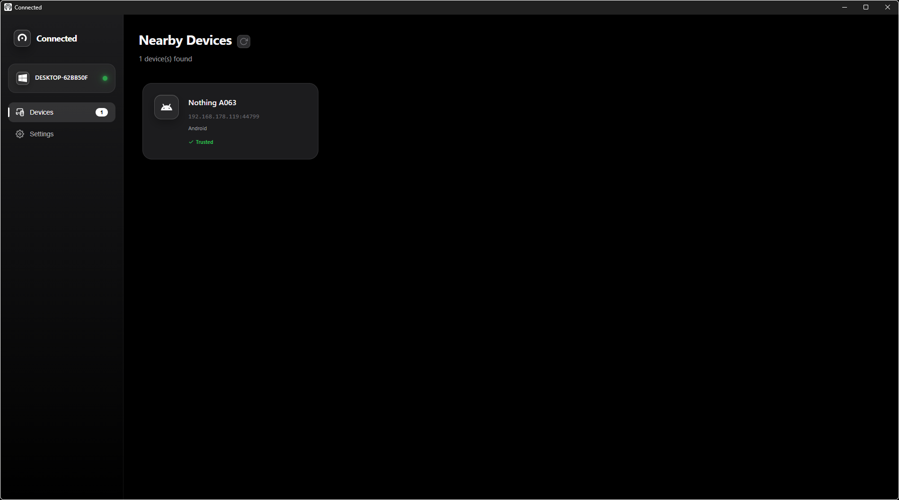 | 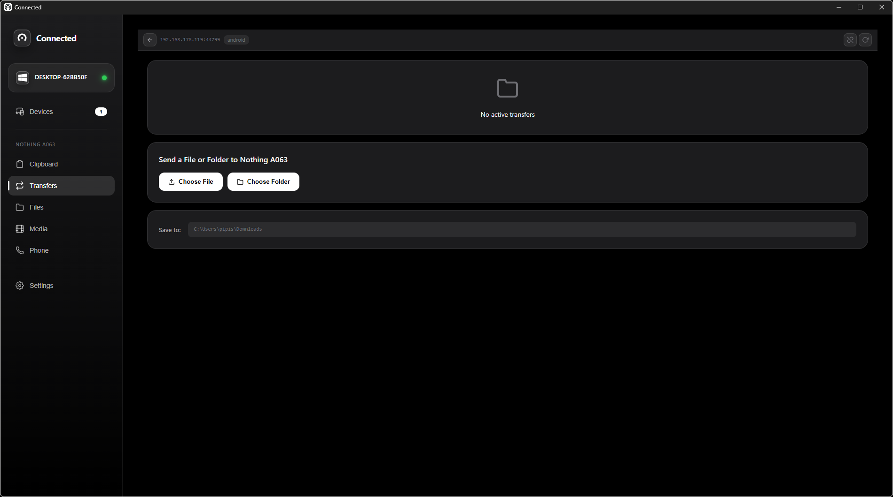 | 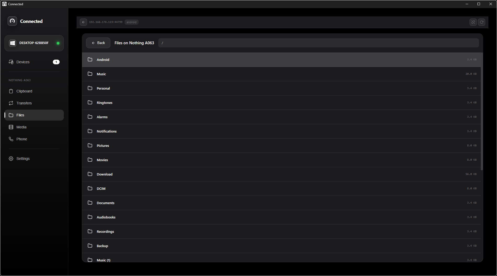 |

| SMS | Inside SMS | Contacts |
|:---:|:---:|:---:|
| 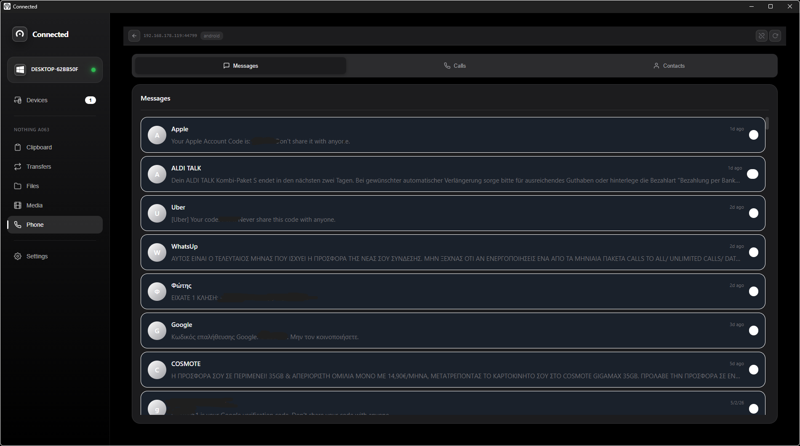 | 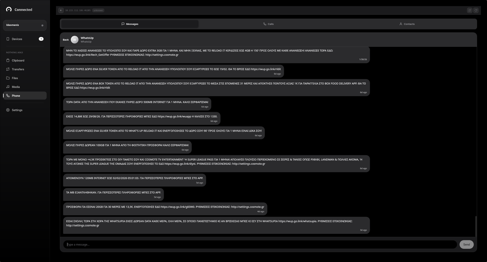 | 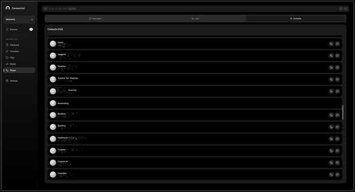 |

| Call Logs | Media Control | Settings |
|:---:|:---:|:---:|
| 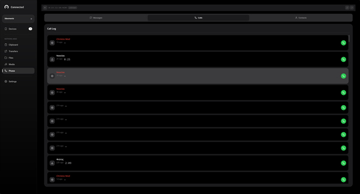 | 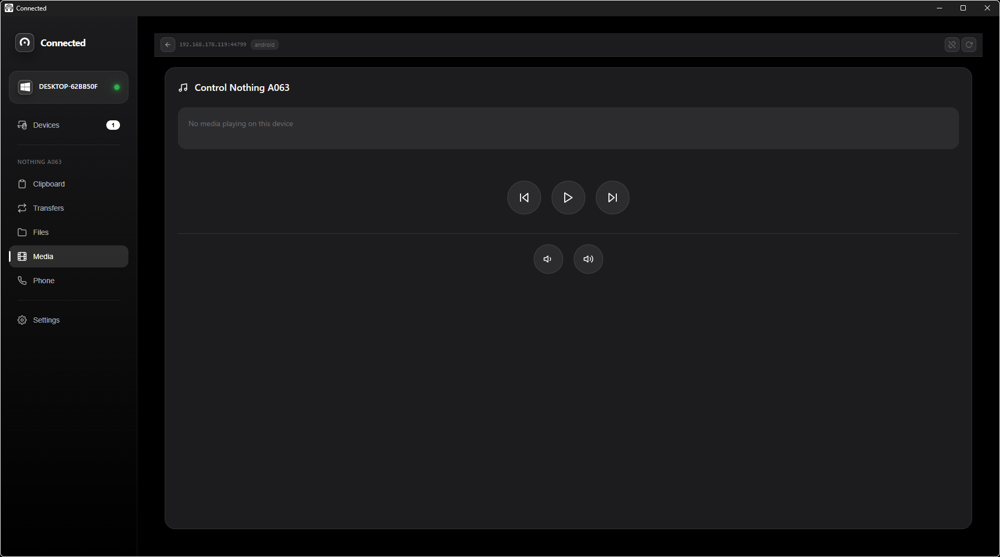 | 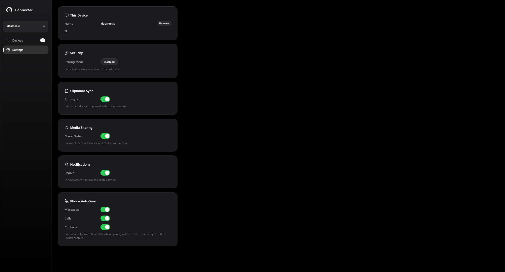 |

### Mobile
| Home | Settings |
|:---:|:---:|
| 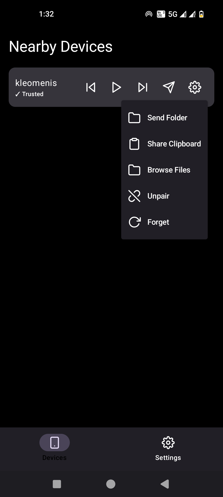 | 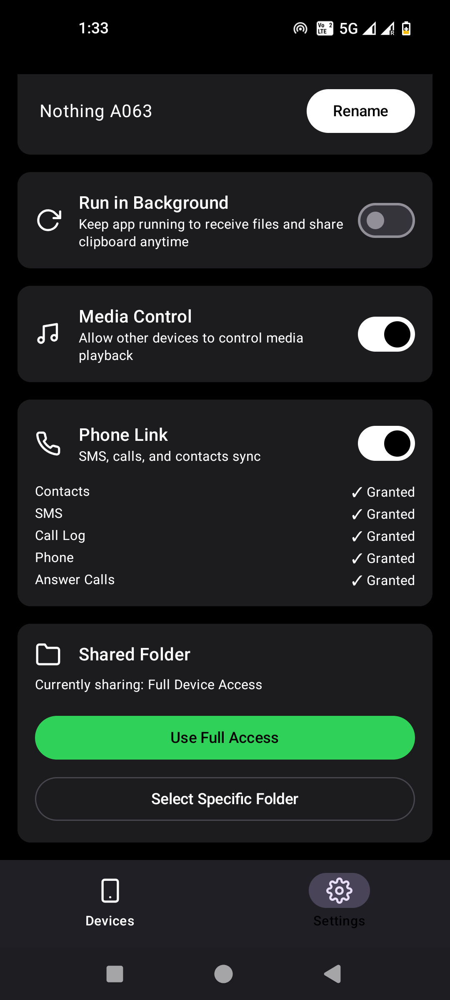 |

## Installation

### Android

1.  Enable **Developer Options** on your Android device.
2.  Connect your device via USB.
3.  Navigate to the `android/` directory:
    ```bash
    cd android
    ```
4.  Build and install the app:
    ```bash
    ./gradlew installDebug
    ```

### Linux (Desktop)

**Requirements:**
-   Rust (stable)
-   `libasound2-dev`, `libudev-dev`, `libdbus-1-dev`, `pkg-config` (Ubuntu/Debian)

1.  Clone the repository:
    ```bash
    git clone https://github.com/paterkleomenis/connected.git
    cd connected
    ```
2.  Run the desktop application:
    ```bash
    cargo run -p connected-desktop
    ```

## Development

### Prerequisites

-   **Rust**: [Install Rust](https://rustup.rs/)
-   **Android Studio**: For Android development (SDK 34+ required).
-   **Cargo NDK**: Required for building the shared library for Android.
    ```bash
    cargo install cargo-ndk
    ```

### Project Structure

-   `core/`: Shared Rust logic (networking, discovery, encryption).
-   `desktop/`: Linux desktop application (Rust + Tauri-like WebView/UI logic).
-   `android/`: Native Android application (Kotlin + Jetpack Compose).
-   `ffi/`: UniFFI bindings to expose the Rust `core` to Kotlin.

## Contributing

Contributions are welcome! Please check out the issues tab or submit a pull request.

1.  Fork the repo.
2.  Create your feature branch (`git checkout -b feature/amazing-feature`).
3.  Commit your changes (`git commit -m 'Add some amazing feature'`).
4.  Push to the branch (`git push origin feature/amazing-feature`).
5.  Open a Pull Request.

## License

This project is licensed under either of

-   Apache License, Version 2.0, ([LICENSE-APACHE](LICENSE-APACHE) or http://www.apache.org/licenses/LICENSE-2.0)
-   MIT license ([LICENSE-MIT](LICENSE-MIT) or http://opensource.org/licenses/MIT)

at your option.
